# 👋 Hi, I'm Manmeet Singh

### Full Stack Developer · IoT & AI Enthusiast

**B.Tech CSE @ PCTE, Ludhiana (2023–2027)**

 

*I build responsive, scalable web apps and IoT-powered systems.*
*Strong in Data Structures & Algorithms (C++) — passionate about problem-solving and shipping impactful software.*

---

## 📊 Metrics

---

## 🛠️ Tech Stack

<table>
  <tr>
    <td><b>💻 Languages</b></td>
    <td>
      
      
      
      
    </td>
  </tr>
  <tr>
    <td><b>🎨 Frontend</b></td>
    <td>
      
      
      
      
      
      
      
    </td>
  </tr>
  <tr>
    <td><b>⚙️ Backend</b></td>
    <td>
      
      
      
    </td>
  </tr>
  <tr>
    <td><b>🗄️ Database</b></td>
    <td>
      
      
      
    </td>
  </tr>
  <tr>
    <td><b>🤖 AI / ML & Automation</b></td>
    <td>
      
      
      
      
    </td>
  </tr>
  <tr>
    <td><b>☁️ Cloud & DevOps</b></td>
    <td>
      
      
      
      
    </td>
  </tr>
  <tr>
    <td><b>🔌 Hardware / IoT</b></td>
    <td>
      
      
    </td>
  </tr>
</table>

---

## 🚀 Featured Projects

<table>
  <tr>
    <td width="50%" valign="top">
      <h3 align="center">🌾 FarmSense AI</h3>
      
<i>Smart IoT Irrigation System</i>

      

        
        
        
      

      <ul>
        <li>Real-time soil moisture & temperature monitoring with automated irrigation</li>
        <li>ESP32 hardware syncing to Firebase; offline control via OLED + joystick</li>
        <li>React Native dashboard with multilingual AI assistant & crop-residue marketplace</li>
      </ul>
      
🏆 <b>Top 15 · Most Innovative Idea (Agri-Tech)</b> CT Hackathon (National Level)

    </td>
    <td width="50%" valign="top">
      <h3 align="center">🏠 Roofing Services Website</h3>
      
<i>Full-Stack Business Website</i>

      

        
        
        
      

      <ul>
        <li>Lead-generation site for a roofing business with mobile-first responsive UI</li>
        <li>Contact form & inquiry pipeline via Express APIs + MongoDB</li>
        <li>Performance-optimized for a smooth customer experience</li>
      </ul>
    </td>
  </tr>
  <tr>
    <td width="50%" valign="top">
      <h3 align="center">🍽️ Dish Rating Predictor</h3>
      
<i>Data Science Internship @ DUCAT</i>

      

        
        
        
      

      <ul>
        <li>XGBoost regression predicting dish ratings from ingredients (1,000 recipes)</li>
        <li>Preprocessing pipeline: ingredient cleaning + TF-IDF vectorization</li>
        <li><b>RMSE 0.63 / MAE 0.52</b> on a 5-point scale, automated evaluation scripts</li>
      </ul>
    </td>
    <td width="50%" valign="top">
      <h3 align="center">📚 Personalized Learning Platform</h3>
      
<i>GNA Hackathon 4.0 — Finalist</i>

      

        
        
      

      <ul>
        <li>Personalized learning platform for students</li>
        <li>Cross-platform apps for teachers & parents to track performance</li>
      </ul>
      
🎯 <b>Finalist</b> — GNA Hackathon 4.0

    </td>
  </tr>
</table>

---

## 🏆 Achievements

| 🏅 | Achievement | Details |
|----|-------------|---------|
| 🥇 | **Winner — Athena Hackathon 2024** | Built a cheating-free online test platform |
| 🎯 | **Finalist — GNA Hackathon 4.0** | Personalized learning platform with teacher/parent tracking |
| 🌱 | **Top 15 (National) — CT Hackathon** | Most Innovative Idea (Agri-Tech) for FarmSense AI |
| 📜 | **Udemy Certified Web Developer** | Full web development certification |

---

## 💼 Experience

**Data Science Intern — DUCAT** *(May 2025 – July 2025, Ludhiana)*
Built an XGBoost regression pipeline for dish-rating prediction: TF-IDF feature extraction, automated model validation with Scikit-learn, reproducible ML environment setup.

---

<b>🌱 Currently...</b>

 

- Deepening DSA skills in C++
- Exploring AI integrations (NVIDIA NIM) and workflow automation with n8n
- Open to internships & collaboration on full-stack and IoT projects

 

*⭐ Feel free to explore my repos and reach out!*

